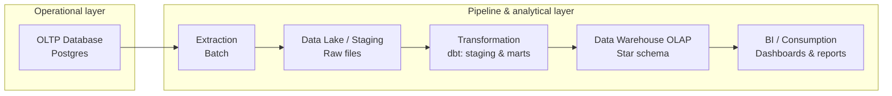

# E-commerce Data Warehouse: PostgreSQL to Snowflake
 
OLTP-to-OLAP data pipeline: PostgreSQL to Snowflake, with dimensional modeling and SQL-based data transformations.
 
## Objective
 
This project simulates a real-world analytics engineering workflow: an e-commerce business runs its day-to-day operations on a transactional database, and that data needs to be extracted, cleaned, and remodeled into a dimensional data warehouse for reporting and business intelligence.
 
The goal is to build the full pipeline end to end — from a normalized OLTP source to a denormalized star-schema OLAP model — using SQL as the primary transformation language, orchestrated with Airflow and containerized with Docker.
 
## Architecture
 

 
**Flow:**
 
1. **OLTP Database (PostgreSQL)** — normalized transactional source, simulating the operational database of an e-commerce platform (orders, customers, products, payments, etc.).
2. **Extraction** — batch extraction of the raw data from Postgres.
3. **Data lake / staging** — raw, untransformed data landed as files, acting as the boundary between the operational and analytical layers.
4. **Transformation** — cleaning, standardization, and dimensional modeling using **dbt**, split into staging and mart layers, all in SQL.
5. **Data Warehouse OLAP (Snowflake)** — final star-schema model (fact and dimension tables) optimized for analytical queries.
6. **BI / Consumption** — dashboards and reports built on top of the warehouse.
## Tech Stack
 
- **Source database:** PostgreSQL (OLTP)
- **Data warehouse:** Snowflake (OLAP)
- **Transformation:** SQL / dbt (staging → marts, dimensional modeling)
- **Orchestration:** Apache Airflow
- **Containerization:** Docker
- **Modeling approach:** Kimball-style dimensional modeling (star schema)
## Status
 
🚧 Work in progress — this README will be updated as each stage of the pipeline (extraction, staging, dbt models, Airflow DAGs, Docker setup) is implemented.
 
## Project Structure
 
```
.
├── docker/           # Docker Compose and service configs
├── dags/             # Airflow DAGs
├── extraction/       # Scripts/SQL for extracting data from Postgres
├── staging/          # Raw/staged data and loading scripts
├── dbt/              # dbt project: staging models, marts, dimensional model
└── README.md
```
