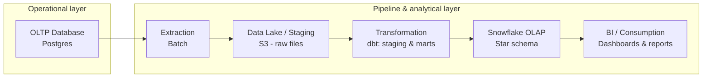

# E-commerce Data Warehouse: PostgreSQL to Snowflake (dbt Modeling)

OLTP-to-OLAP data pipeline: PostgreSQL to Snowflake, with dimensional modeling and SQL-based data transformations using dbt.

## Objective

This project simulates a real-world analytics engineering workflow: an e-commerce business runs its day-to-day operations on a transactional database, and that data needs to be extracted, cleaned, and remodeled into a dimensional model for reporting and business intelligence.

The core focus of this project is **data modeling with dbt**: transforming a normalized OLTP source into a denormalized star-schema OLAP model on Snowflake, using SQL and dbt best practices (staging, intermediate, and mart layers, testing, and documentation). Extraction and orchestration exist to support that modeling work, not the other way around.

## Architecture



**Flow:**

1. **OLTP Database (PostgreSQL)** — normalized transactional source, simulating the operational database of an e-commerce platform (orders, customers, products, payments, etc.).
2. **Extraction** — batch extraction of the raw data from Postgres.
3. **Data lake / staging** — raw, untransformed data landed as files in cloud storage (S3), acting as the boundary between the operational and analytical layers, loaded into Snowflake via `COPY INTO`.
4. **Transformation (core focus)** — cleaning, standardization, and dimensional modeling using **dbt** (`dbt-snowflake` adapter), split into staging, intermediate, and mart layers, all in SQL.
5. **Snowflake OLAP** — final star-schema model (fact and dimension tables) as tables/views in Snowflake, optimized for analytical queries.
6. **BI / Consumption** — dashboards and reports built on top of Snowflake (e.g. an external BI tool connected via Snowflake).

## Tech Stack

- **Source database:** PostgreSQL (OLTP)
- **Data warehouse / OLAP layer:** Snowflake
- **Staging storage:** Cloud object storage (S3) as the raw landing zone
- **Transformation (project focus):** SQL / dbt (`dbt-snowflake` adapter) — staging → intermediate → marts, dimensional modeling, tests, and documentation
- **Orchestration:** Apache Airflow
- **Containerization:** Docker
- **Modeling approach:** Kimball-style dimensional modeling (star schema)

## Status

🚧 Work in progress — this README will be updated as each stage of the pipeline (extraction, staging, dbt models, Airflow DAGs, Docker setup) is implemented.

## Project Structure

```
.
├── docker/           # Docker Compose and service configs
├── dags/             # Airflow DAGs
├── extraction/       # Scripts/SQL for extracting data from Postgres
├── staging/          # Raw/staged data and loading scripts (S3 -> Snowflake COPY INTO)
├── dbt/              # dbt project (dbt-snowflake): staging, intermediate, and mart models — dimensional model
└── README.md
```
