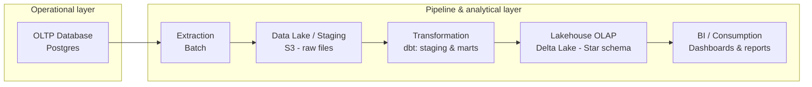

# E-commerce Data Warehouse: PostgreSQL to Databricks (Lakehouse)

OLTP-to-OLAP data pipeline: PostgreSQL to Databricks, with dimensional modeling and SQL-based data transformations on the Lakehouse.

## Objective

This project simulates a real-world analytics engineering workflow: an e-commerce business runs its day-to-day operations on a transactional database, and that data needs to be extracted, cleaned, and remodeled into a dimensional model for reporting and business intelligence.

The goal is to build the full pipeline end to end — from a normalized OLTP source to a denormalized star-schema OLAP model on a Lakehouse (Delta Lake) — using SQL as the primary transformation language, orchestrated with Airflow and containerized with Docker.

## Architecture



**Flow:**

1. **OLTP Database (PostgreSQL)** — normalized transactional source, simulating the operational database of an e-commerce platform (orders, customers, products, payments, etc.).
2. **Extraction** — batch extraction of the raw data from Postgres.
3. **Data lake / staging** — raw, untransformed data landed as files in cloud storage (S3), acting as the boundary between the operational and analytical layers, loaded into Databricks via `COPY INTO`.
4. **Transformation** — cleaning, standardization, and dimensional modeling using **dbt** (`dbt-databricks` adapter), split into staging and mart layers, all in SQL.
5. **Lakehouse OLAP (Databricks / Delta Lake)** — final star-schema model (fact and dimension tables) as managed Delta tables, optimized for analytical queries.
6. **BI / Consumption** — dashboards and reports built on top of the Lakehouse (e.g. Databricks SQL Dashboards or an external BI tool).

## Tech Stack

- **Source database:** PostgreSQL (OLTP)
- **Lakehouse / OLAP layer:** Databricks (Delta Lake), via Databricks SQL / SQL Warehouse
- **Staging storage:** Cloud object storage (S3) as the raw landing zone
- **Transformation:** SQL / dbt (`dbt-databricks` adapter) — staging → marts, dimensional modeling
- **Orchestration:** Apache Airflow
- **Containerization:** Docker
- **Modeling approach:** Kimball-style dimensional modeling (star schema)

## Status

🚧 Work in progress — this README will be updated as each stage of the pipeline (extraction, staging, dbt models, Airflow DAGs, Docker setup) is implemented.

## Project Structure

```
.
├── docker/           # Docker Compose and service configs
├── dags/             # Airflow DAGs
├── extraction/       # Scripts/SQL for extracting data from Postgres
├── staging/          # Raw/staged data and loading scripts (S3 -> Databricks COPY INTO)
├── dbt/              # dbt project (dbt-databricks): staging models, marts, dimensional model
└── README.md
```
