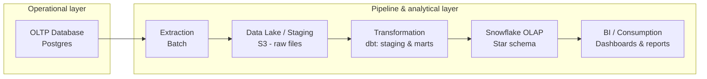

# E-commerce Data Warehouse: PostgreSQL to Snowflake (dbt Modeling)

OLTP-to-OLAP data pipeline: PostgreSQL to Snowflake, with dimensional modeling and SQL-based data transformations using dbt.

## Objective

This project simulates a real-world analytics engineering workflow: an e-commerce business runs its day-to-day operations on a transactional database, and that data needs to be extracted, cleaned, and remodeled into a dimensional model for reporting and business intelligence.

The core focus of this project is **data modeling with dbt**: transforming a normalized OLTP source into a denormalized star-schema OLAP model on Snowflake, using SQL and dbt best practices (staging, intermediate, and mart layers, testing, and documentation). Extraction and orchestration exist to support that modeling work, not the other way around.

## Architecture


```mermaid
flowchart LR
    subgraph op[Operational layer]
        A[OLTP Database\nPostgres]
    end
    subgraph pipeline[Pipeline & analytical layer]
        B[Extraction\nBatch]
        C[Data Lake / Staging\nS3 - raw files]
        D[Transformation\ndbt: staging & marts]
        E[Snowflake OLAP\nStar schema]
        F[BI / Consumption\nDashboards & reports]
    end
    A --> B --> C --> D --> E --> F
```

**Flow:**

1. **OLTP Database (PostgreSQL)** — normalized transactional source, simulating the operational database of an e-commerce platform (orders, customers, products, payments, etc.).
2. **Extraction** ✅ — Python scripts extract the raw Olist tables from Postgres, convert them to Parquet, and upload them to S3 (`data_to_s3/`).
3. **Data lake / staging** ✅ — raw Parquet files land in S3 (`s3://olist-oltp-olap/raw/`) and are loaded into Snowflake's `bronze` schema via an external stage + `COPY INTO` (`sql/snowflake_setup_olist.sql`).
4. **Transformation (core focus)** 🚧 — cleaning, standardization, and dimensional modeling using **dbt** (`dbt-snowflake` adapter), split into staging, intermediate, and mart layers, all in SQL. The **staging layer is complete**: all 9 source tables (`customers`, `geolocation`, `orders`, `order_items`, `order_payments`, `order_reviews`, `products`, `product_category_name_translation`, `sellers`) have staging models with column-level documentation and generic tests (`not_null`, `unique`, `relationships`, `accepted_values`). Intermediate and mart layers are the current focus.
5. **Snowflake OLAP** — final star-schema model (fact and dimension tables) as tables/views in Snowflake, optimized for analytical queries. `bronze`/`silver`/`gold` schemas and role-based access (`dbt_role`/`dbt_user`) are provisioned (`sql/snowflake_grants.sql`).
6. **BI / Consumption** — dashboards and reports built on top of Snowflake (e.g. an external BI tool connected via Snowflake).

## Tech Stack

- **Source database:** PostgreSQL (OLTP)
- **Data warehouse / OLAP layer:** Snowflake
- **Staging storage:** AWS S3 (raw landing zone), loaded via a Snowflake external stage + storage integration
- **Extraction:** Python (`boto3`, `psycopg2`) — Postgres → Parquet → S3
- **Transformation (project focus):** SQL / dbt (`dbt-snowflake` adapter) — staging → intermediate → marts, dimensional modeling, tests, and documentation
- **Orchestration:** Apache Airflow (planned)
- **Containerization:** Docker
- **Modeling approach:** Kimball-style dimensional modeling (star schema)

## Status

🚧 Work in progress.

- ✅ Postgres → S3 extraction scripts
- ✅ Snowflake setup: database, `bronze`/`silver`/`gold` schemas, external stage, storage integration, role/user grants
- ✅ Raw data loaded into `bronze` via `COPY INTO`
- ✅ dbt staging layer: all 9 source models built, documented, and tested
- 🚧 dbt intermediate layer
- 🚧 dbt mart layer (star schema)
- ⏳ Airflow orchestration
- ⏳ BI / consumption layer

## Project Structure

```
.
├── data_to_s3/       # Python extraction: Postgres -> Parquet -> S3
├── sql/              # Snowflake setup: database, schemas, stage, tables, grants
├── olist_dbt/        # dbt project (dbt-snowflake): staging, intermediate, and mart models
│   └── models/
│       ├── staging/      # source-conformed models (done)
│       ├── intermediate/ # business logic layer (in progress)
│       └── marts/        # star schema (in progress)
├── docker-compose.yml
└── README.md
```
